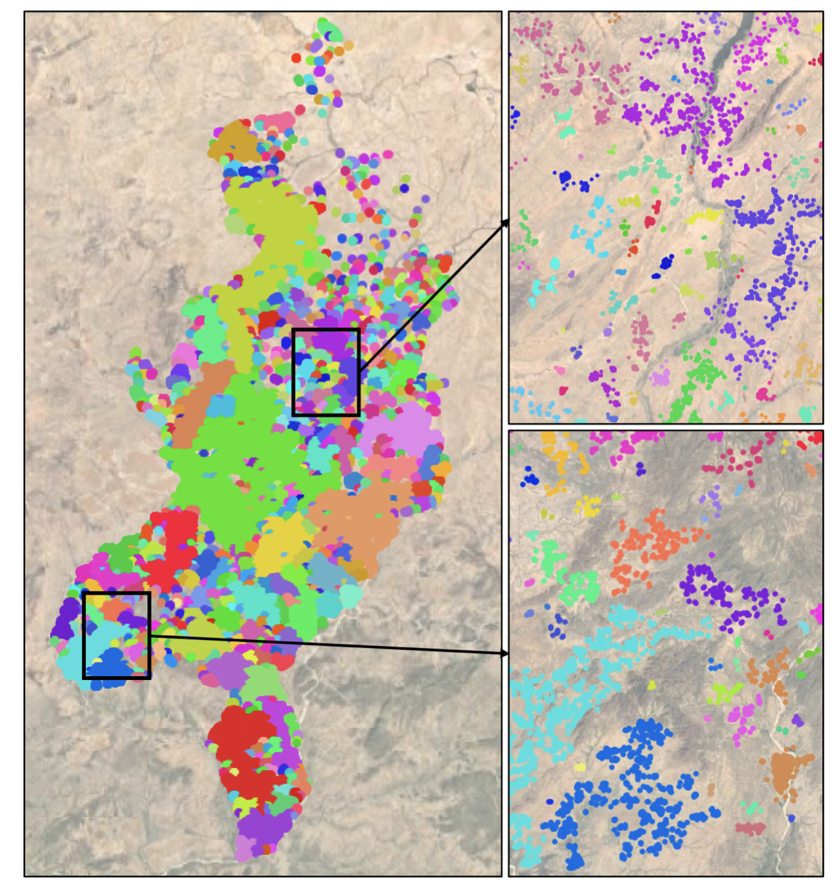
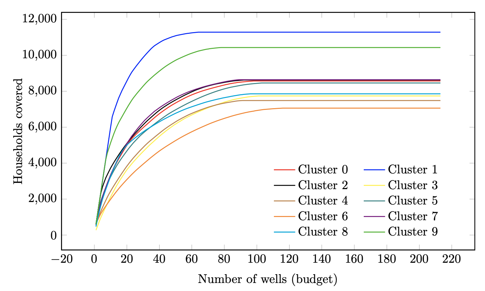

# WaterwellAccess
Supplements to the paper "A method for huge scale maximum covering facility location problems with an application to water well placement in West Darfur".

## Clustering
First step is to cluster using the DBSCAN algortihm. This will result in a set of clusters that are at least 500m distance from each other. To run the algorithm, run: 
[main_clustering.py](https://github.com/valentijnstienen/WaterwellAccess/blob/main/main_clustering.py)

Now, you can examine the resulting data to see if the clusters are small enough such that the facility locaiton problems can be solved to optimality for all the clusters. If not, you may want to create _subclusters_. Set a maximum amount of locations and run the main_clustering_2.py file (https://github.com/valentijnstienen/WaterwellAccess/blob/main/main_clustering_2.py)

In the end you should have a dataframe that indicates for each location to which (sub)cluster it belongs. 

Note that in the main_clustering_2.py file (https://github.com/valentijnstienen/WaterwellAccess/blob/main/main_clustering_2.py), you can also specifcy to compute the corresponding upperboudns on the optimality gaps when using the subclusters (as subclustering means that we cannot guarantee the optimal solution anymore). For details, we again refer to the paper.  

## Create coverage curves
Next, we create the coverage curves (see paper) for all the individual (sub)clusters. You can do this by first filling in the SETTINGS.py file to your wishes. For instnace, include informaton about whether you want to include capacity or not, etc. Then run the main.py file. The result is that we have a coverage curve for each clusters. Example coverage curves are given below: 

## Maximize the coverage
Finally, given the information of the previous step, we determine for each cluster how many facilities are assigned to this cluster, such that we maximize the total coverage (over the whole region). To do this run: 

optimizing_coverage.py (https://github.com/valentijnstienen/WaterwellAccess/blob/main/optimizing_coverage.py)
